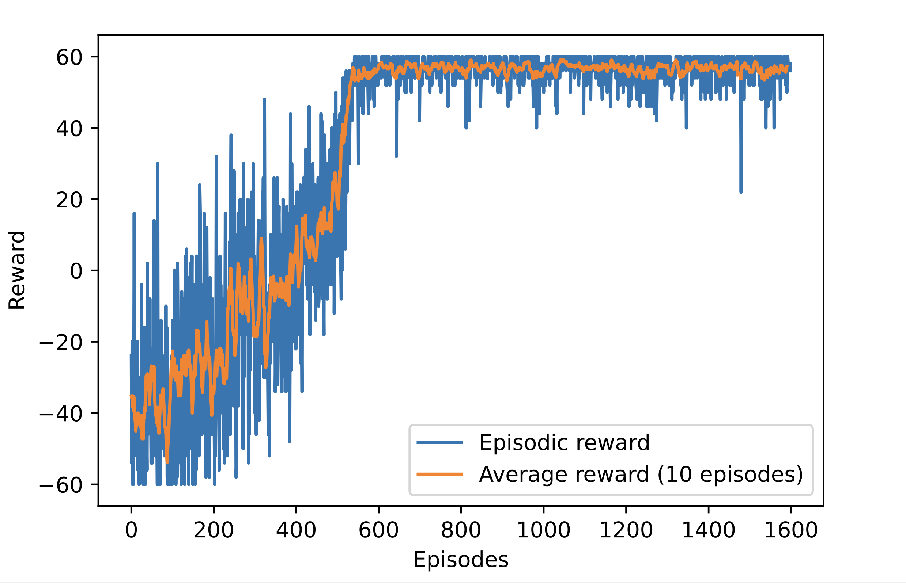

# Shower Temperature Control with DQN

## Overview

*This GitHub repository contains a reinforcement learning solution for the task of maintaining the temperature of a shower within the optimal range of 37 - 39 °C. The implemented solution utilizes a Deep Q-Network (DQN) composed of a policy network and a target network. The target network's weights are updated through Experience Replay, and the update procedure is smoothed by computing the updated weight as a weighted average between the policy and target networks, with the latter having a higher weight.*

## Author
[Bosso Francesco](https://github.com/FBosso) - (fra.bosso97@gmail.com)

## Problem statement
The goal is to design an intelligent agent that learns to control the shower temperature, adapting to external factors such as the flush of the toilet or similar phenomena. The starting state is initialized with a random temperature ranging from 38 ± 3 °C to introduce variability in the environment.

## Approach

### DQN Architecture
+ Policy Network: The neural network responsible for learning the policy to control the shower temperature.
+ Target Network: A separate neural network with weights updated computing a weighted average between the policy and target networks, with the target network having a higher weight.

The update is performed by means of sampling episodes for the Replay Buffer (i.e.: Experience Replay)

### Random Noise

At every step, a random noise of ±1 °C is added to simulate external disturbances like the flush of the toilet.

## Dependencies
This project relies on the following libraries:
+ [gym](https://www.gymlibrary.dev/index.html): Used to create the custom environment for the shower temperature control problem.
'''bash
pip install gym
'''
+ [numpy](https://numpy.org/): Used for array operations.
'''bash
pip install numpy
'''
+ [PyTorch](https://pytorch.org/): Employed to train the neural network.

## Usage
To run the project, make sure to install the required dependencies mentioned above. Then, execute the script "main.py"